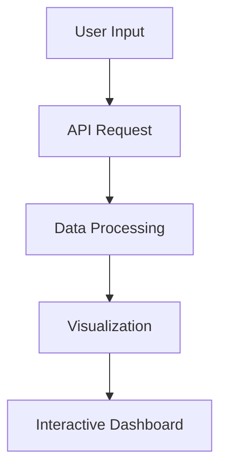

# 🔍 Gitlify - GitHub Profile Analytics Dashboard

<div align="center">


**Discover insights about your coding activity with beautiful visualizations**

<br>

<a href="https://your-live-site-url.com">
  
</a>
<a href="https://github.com/yourusername/gitlify">
  
</a>

<br><br>


</div>

---

## 📋 Table of Contents

<table>
<tr>
<td width="50%">

### 🎯 **Project Overview**

- [🚀 Features](#-features)
- [🛠 Tech Stack](#-tech-stack)
- [⚙️ How It Works](#️-how-it-works)

</td>
<td width="50%">

### 💻 **Getting Started**

- [📊 Development Status](#-development-status)
- [💻 Installation](#-installation)
- [📱 Usage Guide](#-usage-guide)

</td>
</tr>
</table>

<div align="center">

### 🤝 **Community**

[🤝 Contributing](#-contributing) • [🌟 Support](#-show-your-support) •
[📈 Statistics](#-repository-statistics)

</div>

---

## 🚀 Features

<table>
<tr>
<td width="50%" valign="top">

### 🎯 **Core Analytics**

- **📊 Dynamic Repository Analytics**  
  Real-time filtering, sorting & detailed language breakdown
- **🎨 Smart Language Detection**  
  API-powered detailed language stats with byte-level accuracy
- **🔍 Intelligent Repository Search**  
  Search across repository names, descriptions, and topics
- **🔥 Contribution Heatmap**  
  GitHub-style activity calendar with streak tracking
- **⭐ Advanced Star Tracking**  
  Beautiful star display with performance metrics

</td>
<td width="50%" valign="top">

### 👥 **Advanced Features**

- **🔐 GitHub Token Authentication**  
  5,000 requests/hour vs 60/hour (secure local storage)
- **📈 Interactive Visualizations**  
  Dynamic pie charts & timeline with close controls
- **💾 Smart Search Memory**  
  FIFO history with pattern matching (last 5 searches)
- **⚡ Performance Optimized**  
  Smart caching, batch API processing, rate limit handling
- **🎯 Progressive Enhancement**  
  Detailed analysis for small repo sets, fast cache for large sets
- **✨ Professional UI/UX**  
  Glassmorphism design with enhanced error handling

</td>
</tr>
</table>

### 🎨 **User Experience Highlights**

<div align="center">

| Feature                   | Description                                  |
| ------------------------- | -------------------------------------------- |
| **🌙 Adaptive Theming**   | Dynamic backgrounds for landing vs dashboard |
| **📱 Fully Responsive**   | Optimized for desktop, tablet, and mobile    |
| **⚡ Real-time Feedback** | Loading states and smooth animations         |
| **🛡️ Error Resilient**    | Comprehensive error handling with fallbacks  |

</div>

---

## 🛠 Tech Stack

<div align="center">

### **Frontend Technologies**


</div>

<table>
<tr>
<td width="50%" valign="top">

### **🏗️ Core Architecture**

- **ES6 Modules** - Modern JavaScript organization
- **Vanilla JavaScript** - No framework dependencies
- **CSS Grid & Flexbox** - Advanced responsive layouts
- **CSS Custom Properties** - Dynamic theming system

</td>
<td width="50%" valign="top">

### **🌐 API & Data**

- **GitHub REST API v3** - Real-time data fetching
- **Fetch API** - Modern HTTP client
- **Async/Await** - Clean asynchronous patterns
- **Smart Caching** - Optimized performance

</td>
</tr>
</table>

---

## ⚙️ How It Works

<div align="center">

### **🔄 Application Flow**



</div>

<table>
<tr>
<td width="25%" align="center">

### **1️⃣ Input**

🔍 **Search Interface**

- Username validation
- Loading states
- Error handling

</td>
<td width="25%" align="center">

### **2️⃣ Fetch**

🌐 **API Integration**

- GitHub REST API
- Rate limit management
- Data aggregation

</td>
<td width="25%" align="center">

### **3️⃣ Process**

⚙️ **Data Pipeline**

- Normalization
- Statistical analysis
- Chart preparation

</td>
<td width="25%" align="center">

### **4️⃣ Visualize**

📊 **Rendering**

- Chart.js integration
- Responsive grids
- Interactive elements

</td>
</tr>
</table>

### **🏗️ Modular Architecture**

<details>
<summary><strong>📁 Component Structure</strong></summary>

- **🔧 API Service Layer** - Centralized data fetching and caching
- **🎨 Language Service** - Color mapping and normalization logic
- **📊 Dashboard Module** - Repository analysis and visualization
- **👥 Comparison Module** - Multi-user analysis with radar charts
- **🔥 Heatmap Module** - Contribution calendar implementation

</details>

---

## 📊 Development Status

<div align="center">

### **🎯 Project Progress**


</div>

<table>
<tr>
<td width="33%" valign="top">

### **✅ Completed Features**

- ✅ Core search functionality
- ✅ Repository analytics
- ✅ Language distribution
- ✅ Contribution heatmap
- ✅ Multi-user comparison
- ✅ Responsive design
- ✅ Modern UI/UX
- ✅ API caching system

</td>
<td width="33%" valign="top">

### **🚧 In Progress**

- ⏳ Activity timeline
- ⏳ Collaboration metrics
- ⏳ Recent activity feed
- ⏳ PWA support
- ⏳ Offline caching
- ⏳ Performance audit

</td>
<td width="33%" valign="top">

### **🎯 Planned Features**

- 📄 PDF export
- 🔄 Real-time polling
- 🔐 GitHub OAuth
- 📊 Private repo support
- 📅 Custom date ranges
- 👥 Team metrics

</td>
</tr>
</table>

<details>
<summary><strong>📈 Detailed Development Roadmap</strong></summary>

### **Phase 1: Core Features (MVP) - 85% Complete**

- [x] Project structure setup
- [x] API service foundation
- [x] Repository data fetching & pagination
- [x] Sorting & filtering functionality
- [x] Language analytics & visualization
- [x] Contribution heatmap
- [ ] Activity timeline (In Progress)
- [ ] Collaboration metrics (Planned)

### **Phase 2: Performance & UX - 60% Complete**

- [x] API response caching
- [x] Loading states & error handling
- [x] Mobile responsiveness
- [ ] PWA installation support
- [ ] Offline caching strategy
- [ ] Performance optimization

### **Phase 3: Advanced Features - 20% Complete**

- [x] Theme switching
- [ ] PDF export functionality
- [ ] Real-time data polling
- [ ] GitHub OAuth integration
- [ ] Private repository support

</details>

---

## 💻 Installation

<div align="center">

### **🚀 Quick Start Guide**

</div>

<table>
<tr>
<td width="50%" valign="top">

### **📋 Prerequisites**

- Modern web browser (Chrome 70+, Firefox 65+, Safari 12+)
- Local web server capability
- Internet connection for GitHub API

### **⚡ Recommended Tools**

- **Python** `python -m http.server`
- **Node.js** `npx serve .`
- **VS Code** Live Server extension

</td>
<td width="50%" valign="top">

### **📥 Installation Steps**

```bash
# 1. Clone repository
git clone https://github.com/yourusername/gitlify.git

# 2. Navigate to directory
cd gitlify

# 3. Start local server
python -m http.server 8000
# OR
npx serve .

# 4. Open in browser
http://localhost:8000
```

</td>
</tr>
</table>

<div align="center">

**⚠️ Important:** Use a local server to avoid CORS issues with the GitHub API

</div>

---

## 📱 Usage Guide

<table>
<tr>
<td width="33%" align="center">

### **1️⃣ Search**


Enter any public GitHub username or use suggested profiles (octocat, torvalds,
gaearon)

</td>
<td width="33%" align="center">

### **2️⃣ Analyze**


Explore repositories, languages, and contribution patterns with interactive
charts

</td>
<td width="33%" align="center">

### **3️⃣ Compare**


Add multiple users to compare coding patterns and language preferences

</td>
</tr>
</table>

### **📊 Available Analytics**

<details>
<summary><strong>🎯 Repository Analytics</strong></summary>

- **Overview Statistics** - Total repos, stars, forks
- **Language Distribution** - Pie charts and percentages
- **Sorting Options** - By stars, forks, date, name
- **Filtering** - Language, license, fork status
- **Individual Repository Details** - Language breakdown per repo

</details>

<details>
<summary><strong>🔥 Contribution Analysis</strong></summary>

- **Activity Heatmap** - GitHub-style contribution calendar
- **Streak Tracking** - Current and longest contribution streaks
- **Intensity Levels** - Color-coded contribution frequency
- **Interactive Tooltips** - Date and contribution count details

</details>

<details>
<summary><strong>👥 User Comparison</strong></summary>

- **Radar Charts** - Multi-dimensional language comparison
- **Side-by-side Statistics** - Repository and activity metrics
- **Language Evolution** - Track changes over time
- **Performance Benchmarking** - Compare coding patterns

</details>

---

## 🤝 Contributing

<div align="center">

### **We Welcome Contributors!**


</div>

<table>
<tr>
<td width="50%" valign="top">

### **🎯 Ways to Contribute**

- 🐛 **Report Bugs** - Help us identify issues
- 💡 **Feature Requests** - Suggest improvements
- 🔧 **Code Contributions** - Submit pull requests
- 📖 **Documentation** - Improve guides and docs
- 🎨 **Design** - Enhance UI/UX

</td>
<td width="50%" valign="top">

### **📋 Development Guidelines**

- Follow ES6+ JavaScript standards
- Maintain modular architecture
- Write semantic, accessible code
- Test across browsers and devices
- Clear, descriptive commit messages

</td>
</tr>
</table>

<div align="center">

<a href="https://github.com/yourusername/gitlify/issues">
  
</a>
<a href="https://github.com/yourusername/gitlify/pulls">
  
</a>

</div>

---

## 📈 Repository Statistics

<div align="center">

### **📊 Project Metrics**

<table>
<tr>
<td align="center">
  
  <br><strong>Issues</strong>
</td>
<td align="center">
  
  <br><strong>Pull Requests</strong>
</td>
<td align="center">
  
  <br><strong>Last Commit</strong>
</td>
<td align="center">
  
  <br><strong>Languages</strong>
</td>
</tr>
</table>

</div>

---

## 🌟 Show Your Support

<div align="center">

### **Help Gitlify Grow!**

<table>
<tr>
<td align="center" width="25%">
  <h3>⭐</h3>
  <strong>Star</strong>
  <br><small>Show appreciation</small>
</td>
<td align="center" width="25%">
  <h3>🍴</h3>
  <strong>Fork</strong>
  <br><small>Customize & contribute</small>
</td>
<td align="center" width="25%">
  <h3>📢</h3>
  <strong>Share</strong>
  <br><small>Spread the word</small>
</td>
<td align="center" width="25%">
  <h3>🐛</h3>
  <strong>Report</strong>
  <br><small>Help improve</small>
</td>
</tr>
</table>

<br>

<a href="https://github.com/yourusername/gitlify">
  
</a>

</div>

---

<div align="center">

<br>


### **🚀 Ready to explore your GitHub story?**

<a href="https://your-live-site-url.com">
  
</a>

<br><br>

_Transform your GitHub data into beautiful, actionable insights_

<br>

---

<sub>© 2025 Gitlify • Built for the developer community</sub>

</div>
